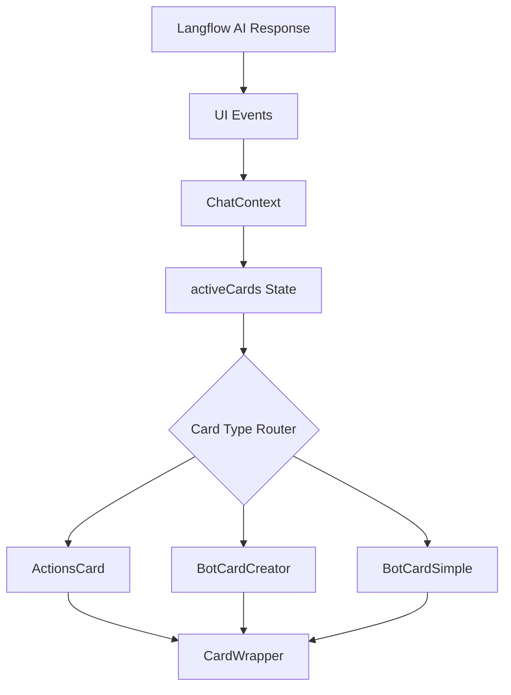

# Design Document: Action and Bot Cards

## Overview

This design document describes the implementation of three new card components for the Deriv Neo trading simulator: ActionsCard, BotCardCreator, and BotCardSimple. These components follow the existing card architecture pattern using CardWrapper, BaseCard types, and Tailwind CSS styling with dark/light theme support.

The cards integrate with the AI-first paradigm where the Concierge agent generates UI events that create and manage cards dynamically based on user conversations.

## Architecture

### Component Hierarchy

```
src/components/cards/
├── CardWrapper.tsx          (existing - base wrapper)
├── ActionsCard.tsx          (new - action management)
├── BotCardCreator.tsx       (new - bot config flowchart)
└── BotCardSimple.tsx        (new - simple bot management)

src/types/
└── index.ts                 (extended with new types)

src/pages/
└── CardsPage.tsx            (extended with new card previews)
```

### Data Flow



## Components and Interfaces

### ActionsCard Component

```typescript
// ActionsCard.tsx
interface ActionsCardProps {
  card: BaseCard;
}

// Component structure:
// - CardWrapper (amber accent)
//   - Icon container (Zap icon)
//   - Content area
//     - Label + Action ID
//     - Name (title)
//     - Description
//     - Status badge
//     - Last execution timestamp
//   - Action buttons row (right-aligned)
//     - Execute (Play icon)
//     - Edit (Pencil icon)
//     - Delete (Trash2 icon)
//     - Schedule (Calendar icon)
```

### BotCardCreator Component

```typescript
// BotCardCreator.tsx
interface BotCardCreatorProps {
  card: BaseCard;
}

// Component structure:
// - CardWrapper (cyan accent)
//   - Header
//     - Bot icon + "NEW BOT CONFIGURATION" label
//     - Bot name/strategy subtitle
//   - Flowchart area
//     - Trigger box (cyan) ──┐
//     - Action box (green) ──┼── Connected with lines
//     - Target box (amber) ──┘
//           │
//     - Condition box (amber/orange)
//   - Footer buttons
//     - Deploy Bot (green)
//     - Edit Config (neutral)
//     - Cancel (neutral)
```

### BotCardSimple Component

```typescript
// BotCardSimple.tsx
interface BotCardSimpleProps {
  card: BaseCard;
}

// Component structure:
// - CardWrapper (amber accent)
//   - Icon container (Bot icon with status dot)
//   - Content area
//     - Label + Bot ID
//     - Name (title)
//     - Strategy description
//     - Status badge + Performance metric
//   - Action buttons row (right-aligned)
//     - Play/Pause toggle (based on status)
//     - Edit (Pencil icon)
//     - Delete (Trash2 icon)
//     - Schedule (Calendar icon)
```

### Shared Action Button Component

```typescript
// Internal to each card - action button styling
interface ActionButtonProps {
  icon: LucideIcon;
  onClick: () => void;
  title: string;
  variant?: 'default' | 'success' | 'danger';
}

// Styling:
// - Default: gray background, hover state
// - All buttons same size (w-8 h-8)
// - Rounded corners (rounded-lg)
// - Theme-aware colors
```

## Data Models

### Type Definitions

```typescript
// Extend CardType union
export type CardType = 
  | 'intent-summary' 
  | 'action-ticket' 
  | 'bot-card' 
  | 'portfolio-snapshot' 
  | 'portfolio-table' 
  | 'portfolio-sidebar' 
  | 'portfolio-table-expanded' 
  | 'portfolio-table-complete' 
  | 'positions-card' 
  | 'trade-card'
  | 'actions-card'      // NEW
  | 'bot-creator'       // NEW
  | 'bot-simple';       // NEW

// ActionsCard payload
export interface ActionsCardPayload {
  actionId: string;
  name: string;
  description: string;
  status: 'active' | 'inactive' | 'error';
  lastExecution?: string; // ISO date string
}

// BotCardCreator payload
export interface BotCreatorPayload {
  botName: string;
  trigger: {
    type: string;    // e.g., "Weekly", "Daily", "Price Alert"
    value?: string;  // e.g., "Monday", "09:00"
  };
  action: {
    type: string;    // e.g., "Buy", "Sell"
    asset: string;   // e.g., "BTC", "ETH"
  };
  target: {
    type: string;    // e.g., "Amount", "Percentage"
    value: string;   // e.g., "$100", "10%"
  };
  condition?: {
    type: string;    // e.g., "Price", "RSI"
    operator: string; // e.g., "<", ">", "="
    value: string;   // e.g., "50000", "70"
  };
}

// BotCardSimple payload
export interface BotSimplePayload {
  botId: string;
  name: string;
  strategy: string;
  status: 'active' | 'paused' | 'stopped';
  performance?: string; // e.g., "+12.5%"
}
```

### Mock Data Examples

```typescript
// ActionsCard mock
const mockActionsCard: BaseCard = {
  id: 'demo-action-card-1',
  type: 'actions-card',
  status: 'active',
  isFavorite: false,
  createdAt: new Date(),
  payload: {
    actionId: 'ACT-001',
    name: 'Weekly BTC Purchase',
    description: 'Automatically buy $100 of Bitcoin every Monday',
    status: 'active',
    lastExecution: '2025-01-27T10:00:00Z',
  },
};

// BotCardCreator mock
const mockBotCreator: BaseCard = {
  id: 'demo-bot-creator-1',
  type: 'bot-creator',
  status: 'active',
  isFavorite: false,
  createdAt: new Date(),
  payload: {
    botName: 'DCA Bitcoin Strategy',
    trigger: { type: 'Weekly', value: 'Monday' },
    action: { type: 'Buy', asset: 'BTC' },
    target: { type: 'Amount', value: '$100' },
    condition: { type: 'Price', operator: '<', value: '50000' },
  },
};

// BotCardSimple mock
const mockBotSimple: BaseCard = {
  id: 'demo-bot-simple-1',
  type: 'bot-simple',
  status: 'active',
  isFavorite: false,
  createdAt: new Date(),
  payload: {
    botId: 'BOT-789',
    name: 'ETH Swing Trader',
    strategy: 'Buy low, sell high based on RSI indicators',
    status: 'active',
    performance: '+8.3%',
  },
};
```

## Correctness Properties

*A property is a characteristic or behavior that should hold true across all valid executions of a system—essentially, a formal statement about what the system should do. Properties serve as the bridge between human-readable specifications and machine-verifiable correctness guarantees.*


Based on the prework analysis, the following properties can be tested:

**Property 1: ActionsCard payload rendering**
*For any* ActionsCardPayload with name, description, and lastExecution fields, the rendered ActionsCard output SHALL contain all provided field values.
**Validates: Requirements 1.1, 1.2, 1.4**

**Property 2: ActionsCard status indicator**
*For any* valid status value (active, inactive, error), the ActionsCard SHALL render the corresponding visual indicator with correct styling.
**Validates: Requirements 1.3**

**Property 3: BotCardCreator configuration rendering**
*For any* BotCreatorPayload with trigger, action, target, and optional condition, the rendered BotCardCreator SHALL display all provided configuration values in the flowchart boxes.
**Validates: Requirements 2.2, 2.3**

**Property 4: BotCardSimple payload rendering**
*For any* BotSimplePayload with name, strategy, status, and optional performance, the rendered BotCardSimple output SHALL contain all provided field values.
**Validates: Requirements 3.1, 3.2, 3.4**

**Property 5: BotCardSimple status indicator**
*For any* valid status value (active, paused, stopped), the BotCardSimple SHALL render the corresponding visual indicator and toggle button icon.
**Validates: Requirements 3.3**

**Property 6: Theme support**
*For any* card component (ActionsCard, BotCardCreator, BotCardSimple) and any theme value (dark, light), the component SHALL render with theme-appropriate colors and styling.
**Validates: Requirements 1.9, 2.9, 3.9**

## Error Handling

### Invalid Payload Handling

Each card component should handle missing or malformed payload data gracefully:

1. **Missing optional fields**: Render without the optional element (e.g., no performance metric, no lastExecution)
2. **Invalid status values**: Default to a neutral/inactive state
3. **Empty strings**: Display placeholder text or hide the element

### Click Handler Errors

All button click handlers use console.log for simulation. In production:
- Wrap handlers in try-catch
- Log errors to monitoring service
- Show user-friendly error toast

## Testing Strategy

### Unit Tests

Unit tests should cover:
- Component renders without crashing with valid props
- All required elements are present in the DOM
- Click handlers are called when buttons are clicked
- Conditional rendering (e.g., performance metric only when provided)

### Property-Based Tests

Property-based tests using a library like fast-check should verify:
- **Property 1**: Generate random ActionsCardPayload, verify all fields appear in render
- **Property 2**: Generate random status values, verify correct indicator
- **Property 3**: Generate random BotCreatorPayload, verify all config values appear
- **Property 4**: Generate random BotSimplePayload, verify all fields appear
- **Property 5**: Generate random status values, verify correct indicator and icon
- **Property 6**: Test each component with both theme values

### Integration Tests

Integration tests should verify:
- Cards render correctly in CardsPage
- CardWrapper integration works (favorite/archive functionality)
- Theme context propagates correctly

### Test Configuration

- Use Vitest as the test runner
- Use React Testing Library for component testing
- Use fast-check for property-based testing
- Minimum 100 iterations per property test
- Tag format: **Feature: action-bot-cards, Property {number}: {property_text}**

## Visual Design Specifications

### ActionsCard Layout

```
┌─────────────────────────────────────────────────────────────┐
│ ┌────┐  ACTION  ACT-001                    [▶][✎][🗑][📅] │
│ │ ⚡ │  Weekly BTC Purchase                                │
│ └────┘  Automatically buy $100 of Bitcoin every Monday     │
│         ● Active    Last run: Jan 27, 2025 10:00 AM        │
└─────────────────────────────────────────────────────────────┘
```

### BotCardCreator Layout

```
┌─────────────────────────────────────────────────────────────┐
│ 🤖 NEW BOT CONFIGURATION                                    │
│ "DCA Bitcoin Strategy"                                      │
│─────────────────────────────────────────────────────────────│
│                                                             │
│   ┌─────────┐      ┌─────────┐      ┌─────────┐            │
│   │ Trigger │──────│ Action  │──────│ Target  │            │
│   │ Weekly  │      │ Buy BTC │      │ $100    │            │
│   └─────────┘      └─────────┘      └─────────┘            │
│         │                                │                  │
│         └────────────┬───────────────────┘                  │
│                      │                                      │
│               ┌──────┴──────┐                               │
│               │  Condition  │                               │
│               │ Price < 50k │                               │
│               └─────────────┘                               │
│                                                             │
│─────────────────────────────────────────────────────────────│
│ [Deploy Bot]  [Edit Config]  [Cancel]                       │
└─────────────────────────────────────────────────────────────┘
```

### BotCardSimple Layout

```
┌─────────────────────────────────────────────────────────────┐
│ ┌────┐  TRADING BOT  BOT-789               [▶][✎][🗑][📅] │
│ │ 🤖●│  ETH Swing Trader                                   │
│ └────┘  Buy low, sell high based on RSI indicators         │
│         ● Active                              +8.3% ↗      │
└─────────────────────────────────────────────────────────────┘
```

### Color Palette

| Element | Dark Theme | Light Theme |
|---------|------------|-------------|
| Card Background | zinc-900/80 | white |
| Card Border | color-500/20 | color-500/20 |
| Primary Text | white | gray-900 |
| Secondary Text | zinc-400 | gray-600 |
| Action Buttons | zinc-700 hover:zinc-600 | gray-200 hover:gray-300 |
| Trigger Box | cyan-500/20, cyan-500 text | cyan-100, cyan-700 text |
| Action Box | green-500/20, green-500 text | green-100, green-700 text |
| Target Box | amber-500/20, amber-500 text | amber-100, amber-700 text |
| Condition Box | orange-500/20, orange-500 text | orange-100, orange-700 text |
| Deploy Button | #00d0a0 (brand-green) | #00d0a0 |
| Status Active | red-500 | red-500 |
| Status Paused | amber-500 | amber-500 |
| Status Stopped | zinc-500 | gray-500 |
