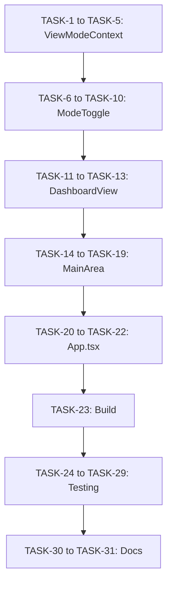

# Implementation Plan: Dashboard Mode

## Overview

Adicionar Dashboard Mode ao sistema de dual-view existente, criando um terceiro modo com layout grid customizável.

## Prerequisites

✅ ViewModeContext existente com persistência
✅ ModeToggle funcional (2 modos)
✅ MainArea com renderização condicional
✅ CardsSidebar com resize
✅ Sidebar (left) com collapse
✅ Tailwind CSS configurado
✅ lucide-react disponível

## Dependencies Check

**Dependências Necessárias:**
- React ✅ (v18.3.1)
- Tailwind CSS ✅ (v3.4.1)
- lucide-react ✅ (v0.344.0)
- TypeScript ✅ (v5.5.3)

**Resultado:** ✅ TODAS as dependências já estão instaladas. Não precisa instalar nada.

## Implementation Tasks

### Phase 1: ViewModeContext Updates

**TASK-1: Atualizar ViewMode type**
- [ ] File: `src/store/ViewModeContext.tsx`
- [ ] Mudar `type ViewMode = 'chat' | 'graph'` para `'chat' | 'graph' | 'dashboard'`
- [ ] Atualizar todas as referências ao tipo
- [ ] _Requirements: REQ-2.1_

**TASK-2: Adicionar START_POINTS para dashboard**
- [ ] File: `src/store/ViewModeContext.tsx`
- [ ] Adicionar entrada 'dashboard' no objeto START_POINTS:
  ```typescript
  dashboard: {
    sidebarCollapsed: false,
    cardsSidebarCollapsed: false,
    cardsSidebarWidth: 480,
    chartVisible: false,
  }
  ```
- [ ] _Requirements: REQ-2.2_

**TASK-3: Atualizar toggleMode para 3 modos**
- [ ] File: `src/store/ViewModeContext.tsx`
- [ ] Modificar lógica de toggleMode para ciclar: chat → graph → dashboard → chat
- [ ] Implementar:
  ```typescript
  const modes: ViewMode[] = ['chat', 'graph', 'dashboard'];
  const currentIndex = modes.indexOf(state.currentMode);
  const nextIndex = (currentIndex + 1) % modes.length;
  ```
- [ ] _Requirements: REQ-1.5_

**TASK-4: Atualizar userPoints Record**
- [ ] File: `src/store/ViewModeContext.tsx`
- [ ] Garantir que `userPoints: Record<ViewMode, UserPoint>` inclui 'dashboard'
- [ ] Atualizar initial state:
  ```typescript
  userPoints: { chat: {}, graph: {}, dashboard: {} }
  ```
- [ ] _Requirements: REQ-2.3_

**TASK-5: Verificar persistência localStorage**
- [ ] File: `src/store/ViewModeContext.tsx`
- [ ] Confirmar que loadFromStorage valida 'dashboard' como modo válido
- [ ] Adicionar validação se necessário:
  ```typescript
  if (!['chat', 'graph', 'dashboard'].includes(parsed.currentMode)) {
    return { currentMode: 'chat', ... };
  }
  ```
- [ ] _Requirements: REQ-2.4_

### Phase 2: ModeToggle Redesign

**TASK-6: Importar LayoutDashboard icon**
- [ ] File: `src/components/layout/ModeToggle.tsx`
- [ ] Adicionar import: `import { MessageSquare, TrendingUp, LayoutDashboard } from 'lucide-react'`
- [ ] _Requirements: REQ-1.4_

**TASK-7: Atualizar estrutura HTML para 3 botões**
- [ ] File: `src/components/layout/ModeToggle.tsx`
- [ ] Remover lógica de toggle binário
- [ ] Adicionar `setMode` do contexto: `const { currentMode, setMode } = useViewMode()`
- [ ] Criar 3 botões: Chat, Graph, Dashboard
- [ ] _Requirements: REQ-1.3_

**TASK-8: Implementar slider animation para 3 posições**
- [ ] File: `src/components/layout/ModeToggle.tsx`
- [ ] Calcular posição do slider:
  ```typescript
  const sliderPosition =
    currentMode === 'chat' ? 0 :
    currentMode === 'graph' ? 1 : 2;
  ```
- [ ] Atualizar style do slider:
  ```typescript
  style={{
    width: 'calc(33.333% - 4px)',
    left: `calc(${sliderPosition * 33.333}% + 4px)`
  }}
  ```
- [ ] _Requirements: REQ-1.3_

**TASK-9: Atualizar estilos do slider por modo**
- [ ] File: `src/components/layout/ModeToggle.tsx`
- [ ] Chat: manter atual (zinc/white)
- [ ] Graph: manter atual (red gradient)
- [ ] Dashboard: adicionar novo gradient (blue ou teal):
  ```typescript
  className={`... ${
    currentMode === 'dashboard'
      ? 'bg-gradient-to-r from-blue-500 to-cyan-500'
      : currentMode === 'graph'
        ? 'bg-gradient-to-r from-red-500 to-rose-500'
        : theme === 'dark' ? 'bg-zinc-600' : 'bg-white shadow-sm'
  }`}
  ```
- [ ] _Requirements: REQ-1.4_

**TASK-10: Atualizar keyboard shortcut**
- [ ] File: `src/components/layout/ModeToggle.tsx`
- [ ] Mudar de `toggleMode()` para ciclar entre 3 modos
- [ ] Verificar se já funciona com o novo toggleMode (deve funcionar automaticamente)
- [ ] _Requirements: REQ-1.5_

### Phase 3: DashboardView Component

**TASK-11: Criar arquivo DashboardView**
- [ ] File: `src/components/dashboard/DashboardView.tsx` (NOVO)
- [ ] Criar estrutura básica do componente
- [ ] Implementar placeholder UI:
  - Icon LayoutDashboard centralizado
  - Título "Dashboard Mode"
  - Descrição placeholder
  - Tip box
- [ ] _Requirements: REQ-4.1, REQ-4.3, REQ-4.4_

**TASK-12: Implementar theme-aware styling**
- [ ] File: `src/components/dashboard/DashboardView.tsx`
- [ ] Usar `useTheme()` hook
- [ ] Aplicar cores dark/light mode:
  - Background: `bg-zinc-900` / `bg-white`
  - Text: `text-white` / `text-gray-900`
  - Borders: `border-zinc-700` / `border-gray-200`
- [ ] _Requirements: REQ-4.3_

**TASK-13: Layout flex container**
- [ ] File: `src/components/dashboard/DashboardView.tsx`
- [ ] Usar `flex-1` para ocupar altura disponível
- [ ] Centralizar conteúdo: `flex items-center justify-center`
- [ ] _Requirements: REQ-4.2_

### Phase 4: MainArea Updates

**TASK-14: Adicionar isDashboardMode prop**
- [ ] File: `src/components/layout/MainArea.tsx`
- [ ] Atualizar interface:
  ```typescript
  interface MainAreaProps {
    isGraphMode: boolean;
    isDashboardMode: boolean;  // NOVO
  }
  ```
- [ ] _Requirements: REQ-6.1_

**TASK-15: Importar DashboardView**
- [ ] File: `src/components/layout/MainArea.tsx`
- [ ] Adicionar import: `import { DashboardView } from '../dashboard/DashboardView'`
- [ ] _Requirements: REQ-6.2_

**TASK-16: Atualizar renderização condicional**
- [ ] File: `src/components/layout/MainArea.tsx`
- [ ] Modificar lógica de renderização:
  ```typescript
  {isDashboardMode ? (
    <DashboardView />
  ) : isGraphMode ? (
    <div className="flex-1" />
  ) : !hasMessages ? (
    <WelcomeScreen />
  ) : (
    // chat content
  )}
  ```
- [ ] _Requirements: REQ-6.2, REQ-6.3_

**TASK-17: Atualizar background gradient condition**
- [ ] File: `src/components/layout/MainArea.tsx`
- [ ] Mudar de `{!isGraphMode && (...)}`
- [ ] Para: `{!isGraphMode && !isDashboardMode && (...)}`
- [ ] _Requirements: REQ-6.3_

**TASK-18: Atualizar ChatInput condition**
- [ ] File: `src/components/layout/MainArea.tsx`
- [ ] Mudar de `{!isGraphMode && (...)}`
- [ ] Para: `{!isGraphMode && !isDashboardMode && (...)}`
- [ ] _Requirements: REQ-6.3_

**TASK-19: Manter ModeToggle visível**
- [ ] File: `src/components/layout/MainArea.tsx`
- [ ] Verificar que ModeToggle renderiza em todos os modos
- [ ] Não adicionar condição ao ModeToggle
- [ ] _Requirements: REQ-6.4_

### Phase 5: App.tsx Integration

**TASK-20: Adicionar isDashboardMode constant**
- [ ] File: `src/App.tsx`
- [ ] Adicionar linha após `isGraphMode`:
  ```typescript
  const isGraphMode = currentMode === 'graph';
  const isDashboardMode = currentMode === 'dashboard';
  ```
- [ ] _Requirements: REQ-6.1_

**TASK-21: Pass isDashboardMode to MainArea**
- [ ] File: `src/App.tsx`
- [ ] Atualizar props do MainArea:
  ```typescript
  <MainArea
    isGraphMode={isGraphMode}
    isDashboardMode={isDashboardMode}
  />
  ```
- [ ] _Requirements: REQ-6.1_

**TASK-22: (Opcional) Pass isDashboardMode to CardsSidebar**
- [ ] File: `src/App.tsx`
- [ ] Se necessário para ajustes específicos de layout
- [ ] Adicionar prop `isDashboardMode={isDashboardMode}`
- [ ] _Requirements: REQ-5.1, REQ-5.2_

### Phase 6: Testing & Verification

**TASK-23: Build verification**
- [ ] Run: `npm run build`
- [ ] Verificar que não há erros de TypeScript
- [ ] Verificar que não há erros de build
- [ ] _Requirements: All_

**TASK-24: Manual testing - Mode Toggle**
- [ ] Abrir aplicação
- [ ] Clicar em cada botão do ModeToggle
- [ ] Verificar que slider anima corretamente
- [ ] Testar keyboard shortcut (Ctrl+Shift+M)
- [ ] _Requirements: REQ-1.1, REQ-1.3, REQ-1.5_

**TASK-25: Manual testing - Dashboard Layout**
- [ ] Entrar no Dashboard Mode
- [ ] Verificar que DashboardView renderiza
- [ ] Verificar que placeholder message está visível
- [ ] Verificar que left sidebar está visível
- [ ] Verificar que right sidebar está visível
- [ ] _Requirements: REQ-3.1, REQ-3.3, REQ-4.4_

**TASK-26: Manual testing - Sidebars**
- [ ] No Dashboard Mode, colapsar/expandir left sidebar
- [ ] Verificar que dashboard ajusta width corretamente
- [ ] Colapsar/expandir right sidebar
- [ ] Resize right sidebar
- [ ] Verificar que não há sobreposição
- [ ] _Requirements: REQ-3.4, REQ-5.3, REQ-5.4, REQ-7.1, REQ-7.2_

**TASK-27: Manual testing - State Persistence**
- [ ] Customizar width da right sidebar no Dashboard Mode
- [ ] Alternar para Chat Mode
- [ ] Voltar para Dashboard Mode
- [ ] Verificar que width customizado foi preservado
- [ ] Recarregar página
- [ ] Verificar que estado foi restaurado
- [ ] _Requirements: REQ-8.1, REQ-8.2, REQ-8.3_

**TASK-28: Manual testing - Theme**
- [ ] Alternar entre dark/light mode
- [ ] Verificar que Dashboard responde ao tema
- [ ] Verificar cores, borders, backgrounds
- [ ] _Requirements: REQ-4.3_

**TASK-29: Manual testing - Transitions**
- [ ] Alternar entre os 3 modos rapidamente
- [ ] Verificar que transições são suaves
- [ ] Verificar que não há layout shifts
- [ ] _Requirements: REQ-9.1, REQ-9.2_

### Phase 7: Documentation & Cleanup

**TASK-30: Update README (optional)**
- [ ] Documentar novo Dashboard Mode
- [ ] Atualizar screenshots se necessário
- [ ] _Requirements: N/A_

**TASK-31: Code review checklist**
- [ ] Remover console.logs de debug
- [ ] Verificar indentação e formatting
- [ ] Verificar que todos os imports são usados
- [ ] Verificar que não há código comentado
- [ ] _Requirements: N/A_

## Implementation Order



## Estimated Effort

### By Component

| Component | Tasks | Lines of Code | Complexity |
|-----------|-------|---------------|------------|
| ViewModeContext | 5 | ~30 LOC | Low |
| ModeToggle | 5 | ~80 LOC | Medium |
| DashboardView | 3 | ~60 LOC | Low |
| MainArea | 6 | ~20 LOC | Low |
| App.tsx | 3 | ~5 LOC | Low |
| Testing | 7 | N/A | Medium |

**Total Estimated LOC:** ~195 linhas de código

**Complexity:** Low-Medium (maioria são mudanças em arquivos existentes)

## Files Summary

### Files to Modify (5 files)
1. `src/store/ViewModeContext.tsx` - Adicionar dashboard mode
2. `src/components/layout/ModeToggle.tsx` - Redesign para 3 botões
3. `src/components/layout/MainArea.tsx` - Adicionar DashboardView
4. `src/App.tsx` - Pass isDashboardMode prop
5. (Opcional) `src/components/layout/CardsSidebar.tsx` - Dashboard-specific adjustments

### Files to Create (1 file)
1. `src/components/dashboard/DashboardView.tsx` - Novo componente

### Files to Read (reference only)
- `src/store/ThemeContext.tsx` - Para useTheme hook
- `src/components/layout/Sidebar.tsx` - Para entender layout
- `src/components/layout/CardsSidebar.tsx` - Para entender resize behavior

## Risk Assessment

### Low Risk
- Adicionar novo tipo 'dashboard' ao ViewMode (isolated change)
- Criar novo componente DashboardView (não afeta código existente)
- Persistência de estado (já funciona, só adiciona novo mode)

### Medium Risk
- ModeToggle redesign (precisa cuidado com animations)
- MainArea condicional rendering (testar bem todos os casos)

### High Risk
- Nenhum (todas as mudanças são incrementais e reversíveis)

## Rollback Plan

Se algo der errado, é fácil reverter:

1. **ViewModeContext**: Reverter tipo para `'chat' | 'graph'`
2. **ModeToggle**: Reverter para 2 botões
3. **MainArea**: Remover isDashboardMode prop
4. **DashboardView**: Deletar arquivo (não é usado por nada)

## Success Criteria

✅ Dashboard Mode funciona e é selecionável
✅ ModeToggle exibe 3 botões com slider correto
✅ DashboardView renderiza no MainArea
✅ Sidebars funcionam corretamente no Dashboard
✅ Estado é persistido entre modos
✅ Build passa sem erros
✅ Nenhum regression nos modos existentes (Chat/Graph)

## Next Steps (Out of Scope)

Após implementação bem-sucedida do Dashboard Mode base:

1. **Phase 2:** Implementar grid system (react-grid-layout)
2. **Phase 3:** Criar widgets (chart, portfolio, cards)
3. **Phase 4:** Adicionar drag-and-drop
4. **Phase 5:** Layout presets e customização avançada
