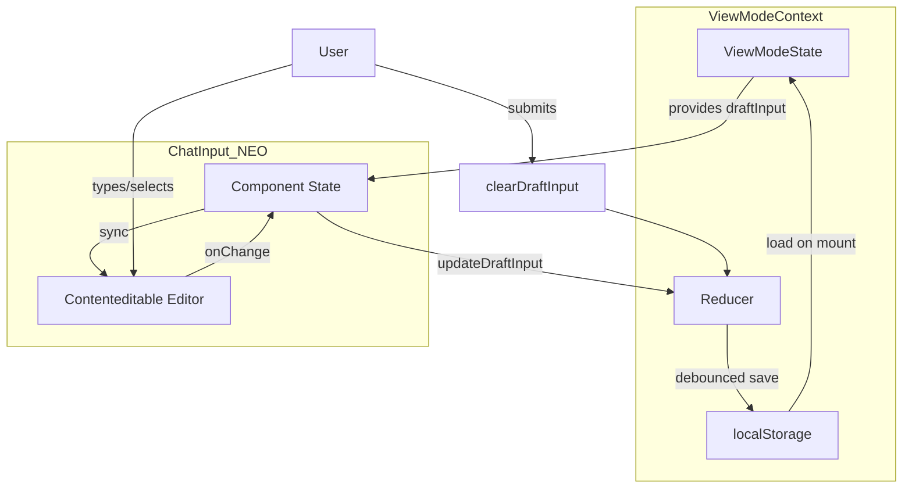

# Design Document: Draft Input Persistence

## Overview

This design extends the existing ViewModeContext to include draft input state persistence. The solution leverages the already-established localStorage mechanism with debounced saving, ensuring minimal code changes while providing robust draft preservation across mode switches and page refreshes.

The key principle is **expansion, not creation** — we add a `draftInput` field to the existing persisted state rather than introducing a new persistence mechanism.

## Architecture



### Data Flow

1. **On Mount**: ViewModeContext loads persisted state including `draftInput` from localStorage
2. **On Input Change**: ChatInput_NEO calls `updateDraftInput()` with partial updates
3. **On Debounce**: ViewModeContext saves entire state (including draft) to localStorage
4. **On Mode Switch**: Draft persists in context, ChatInput_NEO reads from context on render
5. **On Submit**: ChatInput_NEO calls `clearDraftInput()` to reset draft state

## Components and Interfaces

### DraftInput Interface

```typescript
interface DraftInput {
  plainText: string;
  selectedAgents: string[];
  selectedProducts: string[];
  autoMode: boolean;
}
```

### Default Draft State

```typescript
const DEFAULT_DRAFT_INPUT: DraftInput = {
  plainText: '',
  selectedAgents: [],
  selectedProducts: [],
  autoMode: true,
};
```

### Extended ViewModeState

```typescript
interface ViewModeState {
  currentMode: ViewMode;
  userPoints: Record<ViewMode, UserPoint>;
  isResizing: boolean;
  draftInput: DraftInput;  // NEW
}
```

### Extended ViewModeContextValue

```typescript
interface ViewModeContextValue {
  // ... existing properties ...
  draftInput: DraftInput;
  updateDraftInput: (updates: Partial<DraftInput>) => void;
  clearDraftInput: () => void;
}
```

### New Reducer Actions

```typescript
type Action =
  | { type: 'UPDATE_DRAFT_INPUT'; payload: Partial<DraftInput> }
  | { type: 'CLEAR_DRAFT_INPUT' }
  // ... existing actions ...
```

## Data Models

### localStorage Schema (Extended)

The existing `deriv-neo-view-mode` key will store:

```typescript
interface PersistedState {
  currentMode: ViewMode;
  userPoints: Record<ViewMode, UserPoint>;
  draftInput: DraftInput;  // NEW
}
```

### Migration Strategy

When loading from localStorage:
- If `draftInput` is missing (old data), use `DEFAULT_DRAFT_INPUT`
- This ensures backward compatibility with existing stored data

## Correctness Properties

*A property is a characteristic or behavior that should hold true across all valid executions of a system—essentially, a formal statement about what the system should do. Properties serve as the bridge between human-readable specifications and machine-verifiable correctness guarantees.*

### Property 1: Mode Switch Round-Trip

*For any* valid DraftInput state, switching from chat mode to graph mode and back to chat mode SHALL preserve the exact draft state (plainText, selectedAgents, selectedProducts, autoMode).

**Validates: Requirements 1.1, 1.2**

### Property 2: Persistence Round-Trip

*For any* valid DraftInput state, saving to localStorage and then loading from localStorage (simulating page refresh) SHALL produce an equivalent DraftInput state.

**Validates: Requirements 2.1, 2.2**

### Property 3: Debounce Coalescing

*For any* sequence of rapid draft updates within 500ms, only one localStorage write SHALL occur after the debounce period completes.

**Validates: Requirements 2.4**

### Property 4: Clear Resets to Defaults

*For any* non-empty DraftInput state, calling clearDraftInput SHALL result in the draft being reset to the default state (empty plainText, empty arrays, autoMode true) in both context and localStorage.

**Validates: Requirements 3.1, 3.2, 3.3**

### Property 5: Partial Updates Propagate

*For any* partial DraftInput update (plainText, selectedAgents, selectedProducts, or autoMode), calling updateDraftInput with that partial update SHALL merge it with the existing draft state without affecting other fields.

**Validates: Requirements 4.1, 4.2, 4.3, 4.4**

### Property 6: Editor Synchronization on Restore

*For any* DraftInput state with non-empty plainText and/or selectedProducts, restoring that state SHALL result in the contenteditable editor displaying the plainText with product tags rendered as styled inline elements.

**Validates: Requirements 5.1, 5.2**

## Error Handling

### localStorage Errors

- **Read Failure**: If localStorage.getItem fails or returns invalid JSON, use DEFAULT_DRAFT_INPUT
- **Write Failure**: If localStorage.setItem fails (quota exceeded, etc.), silently ignore and continue with in-memory state
- **Migration**: If stored data lacks draftInput field, merge with DEFAULT_DRAFT_INPUT

### Invalid State Recovery

- **Null/Undefined Fields**: If any DraftInput field is null/undefined after load, replace with default value
- **Type Mismatches**: If field types don't match expected (e.g., plainText is not string), use default value

### Component Lifecycle

- **Unmount During Save**: Debounce timer cleanup on unmount to prevent memory leaks
- **Context Not Available**: ChatInput_NEO should handle missing context gracefully (use local state as fallback)

## Testing Strategy

### Unit Tests

Unit tests should cover specific examples and edge cases:

1. **Default State**: Verify DEFAULT_DRAFT_INPUT has correct shape and values
2. **localStorage Key**: Verify correct key 'deriv-neo-view-mode' is used
3. **API Existence**: Verify updateDraftInput and clearDraftInput functions exist on context
4. **Agent Header Display**: Verify selected agents appear in header when restored

### Property-Based Tests

Property tests should use a library like fast-check to verify universal properties:

1. **Property 1**: Generate random DraftInput, switch modes, verify preservation
2. **Property 2**: Generate random DraftInput, save/load cycle, verify equality
3. **Property 3**: Generate rapid update sequence, verify single write after debounce
4. **Property 4**: Generate non-empty DraftInput, clear, verify defaults
5. **Property 5**: Generate partial updates, apply, verify merge behavior
6. **Property 6**: Generate DraftInput with products, restore, verify editor content

### Test Configuration

- Minimum 100 iterations per property test
- Use React Testing Library for component tests
- Mock localStorage for isolation
- Tag format: **Feature: draft-input-persistence, Property {N}: {description}**

