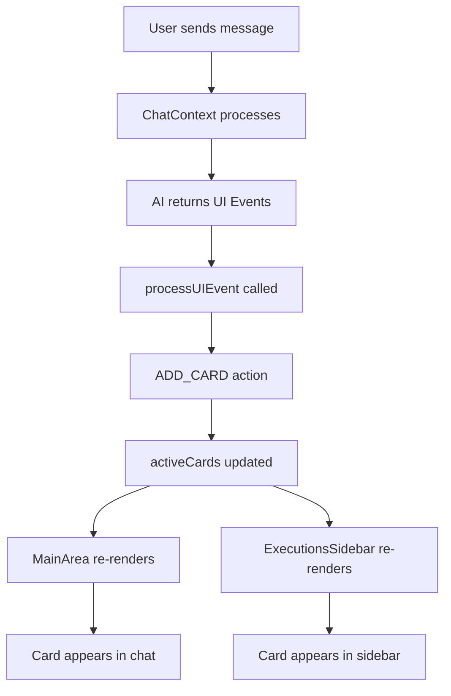

# Design Document: Executions Sidebar

## Overview

Este documento descreve o design técnico para adicionar um sidebar de Executions à direita da interface. O sidebar exibirá todos os cards/módulos dinâmicos gerados durante as interações de chat, criando uma visão persistente das "executions simuladas".

A implementação reutiliza padrões existentes do Left Sidebar e do sistema de cards, garantindo consistência visual e comportamental.

## Architecture

### Layout de Três Colunas

```
┌─────────────┬──────────────────────────┬─────────────┐
│             │                          │             │
│   Left      │                          │  Executions │
│   Sidebar   │       Main Area          │   Sidebar   │
│   (w-72)    │       (flex-1)           │   (w-72)    │
│             │                          │             │
│  - Chats    │  - Chat Messages         │  - Header   │
│  - Favorites│  - Active Cards (inline) │  - Cards    │
│  - Archived │  - Input                 │             │
│             │                          │             │
└─────────────┴──────────────────────────┴─────────────┘
```

### Fluxo de Dados



## Components and Interfaces

### 1. ExecutionsSidebar Component

Novo componente que espelha a estrutura do `Sidebar.tsx` existente.

```typescript
// src/components/layout/ExecutionsSidebar.tsx

interface ExecutionsSidebarProps {
  // No props needed - consumes context directly
}

function ExecutionsSidebar(): JSX.Element {
  // Uses useChat() to access activeCards
  // Uses useTheme() for theme-aware styling
}
```

### 2. ExecutionCard Component

Componente compacto para exibir cards no sidebar, similar ao `SidebarCard.tsx`.

```typescript
// src/components/layout/ExecutionCard.tsx

interface ExecutionCardProps {
  card: BaseCard;
}

function ExecutionCard({ card }: ExecutionCardProps): JSX.Element {
  // Renders compact card with icon, title, type label
  // Hover actions: favorite, archive
}
```

### 3. MainLayout Update

Atualização do layout principal para incluir o terceiro elemento.

```typescript
// src/App.tsx - MainLayout update

function MainLayout(): JSX.Element {
  return (
    <div className="h-screen flex overflow-hidden">
      <Sidebar />           {/* Left - existing */}
      <MainArea />          {/* Center - existing */}
      <ExecutionsSidebar /> {/* Right - new */}
    </div>
  );
}
```

## Data Models

### Existing Types (No Changes Required)

O sistema já possui todos os tipos necessários em `src/types/index.ts`:

```typescript
// Already defined - no changes needed
interface BaseCard {
  id: string;
  type: CardType;
  status: CardStatus;
  isFavorite: boolean;
  createdAt: Date;
  payload: Record<string, unknown>;
}

type CardType = 'intent-summary' | 'action-ticket' | 'bot' | 'portfolio-snapshot';
type CardStatus = 'active' | 'archived' | 'hidden';
```

### Card Display Mapping

```typescript
// Mapping for ExecutionCard display
const cardIcons: Record<CardType, LucideIcon> = {
  'intent-summary': FileText,
  'action-ticket': Zap,
  'bot': Bot,
  'portfolio-snapshot': Wallet,
};

const cardLabels: Record<CardType, string> = {
  'intent-summary': 'Intent',
  'action-ticket': 'Action',
  'bot': 'Bot',
  'portfolio-snapshot': 'Portfolio',
};

// Title derivation logic
function getCardTitle(card: BaseCard): string {
  const payload = card.payload as Record<string, unknown>;
  switch (card.type) {
    case 'intent-summary':
      return (payload.action as string) || 'Intent';
    case 'action-ticket':
      return `${(payload.action as string)?.toUpperCase() || 'Action'} ${payload.asset || ''}`;
    case 'bot':
      return (payload.name as string) || 'Bot';
    case 'portfolio-snapshot':
      return 'Portfolio';
    default:
      return cardLabels[card.type];
  }
}
```

## Correctness Properties

*A property is a characteristic or behavior that should hold true across all valid executions of a system-essentially, a formal statement about what the system should do. Properties serve as the bridge between human-readable specifications and machine-verifiable correctness guarantees.*

### Property 1: Sidebar-ActiveCards Invariant

*For any* state of the ChatContext, the ExecutionsSidebar SHALL display exactly the cards present in activeCards, with the count in the header matching activeCards.length.

**Validates: Requirements 2.2, 2.3, 3.3**

### Property 2: Card Rendering Completeness

*For any* card displayed in the ExecutionsSidebar, the rendered output SHALL contain: the correct icon for the card type, a title derived from the payload, and the card type label.

**Validates: Requirements 4.2, 4.3, 4.4**

### Property 3: Favorite Action Propagation

*For any* card in the ExecutionsSidebar, when the favorite action is triggered, the card's isFavorite property SHALL become true, and the card SHALL appear in both the ExecutionsSidebar (if still active) and the Left Sidebar favorites section.

**Validates: Requirements 5.2, 5.5**

### Property 4: Archive Action Effect

*For any* card in the ExecutionsSidebar, when the archive action is triggered, the card's status SHALL change to 'archived', and the card SHALL be removed from the ExecutionsSidebar active list.

**Validates: Requirements 5.3, 5.4**

### Property 5: Theme Reactivity

*For any* theme change in the ThemeContext, the ExecutionsSidebar SHALL immediately reflect the new theme by applying the corresponding CSS classes (dark or light mode styling).

**Validates: Requirements 6.3**

## Error Handling

### Empty State

Quando `activeCards.length === 0`:
- Exibir mensagem: "No executions yet"
- Manter header visível com contador "0"

### Card Type Unknown

Se um card com tipo desconhecido for recebido:
- Usar ícone padrão (FileText)
- Usar label "Unknown"
- Log warning no console

### Context Not Available

Se o componente for renderizado fora do ChatProvider:
- Throw error com mensagem clara (comportamento existente do useChat hook)

## Testing Strategy

### Unit Tests

Testes específicos para exemplos e edge cases:

1. **Layout Structure Test**: Verificar que MainLayout renderiza três elementos filhos na ordem correta
2. **Empty State Test**: Verificar mensagem de empty state quando activeCards está vazio
3. **Theme Classes Test**: Verificar classes CSS corretas para dark e light themes
4. **Header Elements Test**: Verificar presença de título "Executions", ícone e contador

### Property-Based Tests

Testes baseados em propriedades usando fast-check:

1. **Property 1 Test**: Gerar arrays aleatórios de cards, verificar que sidebar exibe exatamente esses cards
2. **Property 2 Test**: Gerar cards de todos os tipos, verificar que cada um renderiza com icon, title e label corretos
3. **Property 3 Test**: Gerar cards aleatórios, simular favorite action, verificar estado atualizado
4. **Property 4 Test**: Gerar cards aleatórios, simular archive action, verificar remoção da lista ativa
5. **Property 5 Test**: Alternar temas, verificar classes CSS atualizadas

### Testing Configuration

- Framework: Vitest + React Testing Library
- Property Testing: fast-check
- Minimum iterations per property: 100
- Tag format: **Feature: executions-sidebar, Property N: [description]**

