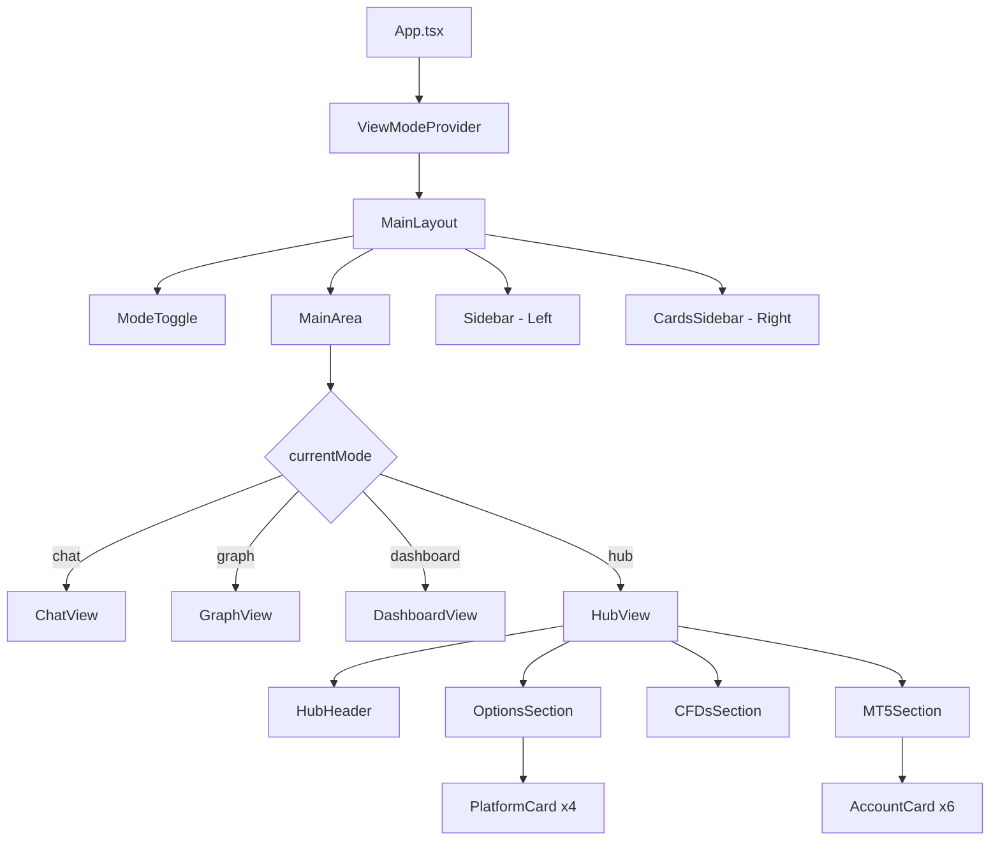

# Design Document: Hub Mode

## Overview

This design document describes the implementation of a new "Hub" mode for the Deriv NEO trading simulator. The Hub mode provides a centralized view of all available trading platforms and MT5 account types, following the Trader's Hub design pattern.

The implementation extends the existing view mode system by:
1. Adding 'hub' to the ViewMode type union
2. Updating the ModeToggle component to display 4 buttons
3. Creating a new HubView component with three sections
4. Configuring sidebar behavior to match graph/dashboard modes

## Architecture

The Hub mode integrates into the existing view mode architecture:



## Components and Interfaces

### 1. ViewModeContext Updates

**File:** `src/store/ViewModeContext.tsx`

```typescript
// Extended ViewMode type
type ViewMode = 'chat' | 'graph' | 'dashboard' | 'hub';

// Extended START_POINTS configuration
const START_POINTS: Record<ViewMode, Required<Omit<UserPoint, never>> & { chartVisible: boolean }> = {
  chat: {
    sidebarCollapsed: false,
    cardsSidebarCollapsed: false,
    cardsSidebarWidth: 575,
    chartVisible: false,
  },
  graph: {
    sidebarCollapsed: true,
    cardsSidebarCollapsed: false,
    cardsSidebarWidth: 690,
    chartVisible: true,
  },
  dashboard: {
    sidebarCollapsed: true,
    cardsSidebarCollapsed: false,
    cardsSidebarWidth: 690,
    chartVisible: false,
  },
  hub: {
    sidebarCollapsed: true,        // Same as graph mode
    cardsSidebarCollapsed: false,
    cardsSidebarWidth: 690,        // Same as graph/dashboard
    chartVisible: false,
  },
};

// Extended userPoints in initial state
userPoints: { chat: {}, graph: {}, dashboard: {}, hub: {} }
```

### 2. ModeToggle Component Updates

**File:** `src/components/layout/ModeToggle.tsx`

```typescript
interface ModeConfig {
  key: ViewMode;
  icon: LucideIcon;
  label: string;
}

const modes: ModeConfig[] = [
  { key: 'chat', icon: MessageSquare, label: 'Chat' },
  { key: 'graph', icon: TrendingUp, label: 'Graph' },
  { key: 'dashboard', icon: LayoutDashboard, label: 'Dash' },
  { key: 'hub', icon: Home, label: 'Hub' },
];

// Slider position calculation
const sliderPositions: Record<ViewMode, string> = {
  chat: 'left-1',
  graph: 'left-[calc(25%+1px)]',
  dashboard: 'left-[calc(50%+1px)]',
  hub: 'left-[calc(75%+1px)]',
};

// Button width: 25% each (was 33.33%)
style={{ width: '25%' }}

// Slider width: calc(25% - 4px) (was calc(33.33% - 4px))
style={{ width: 'calc(25% - 4px)' }}
```

### 3. MainArea Component Updates

**File:** `src/components/layout/MainArea.tsx`

```typescript
interface MainAreaProps {
  isGraphMode: boolean;
  isDashboardMode: boolean;
  isHubMode: boolean;  // New prop
}

// Conditional rendering in MainArea
{isHubMode ? (
  <HubView />
) : isDashboardMode ? (
  <DashboardView />
) : isGraphMode ? (
  <div className="flex-1" />
) : !hasMessages ? (
  <WelcomeScreen />
) : (
  // Chat messages view
)}
```

### 4. HubView Component

**File:** `src/components/layout/HubView.tsx`

```typescript
interface PlatformCardProps {
  icon: string;           // 'DT' | 'DB' | 'ST' | 'GO'
  name: string;
  description: string;
  iconColor: string;      // Tailwind color class
  onOpen: () => void;
}

interface AccountCardProps {
  name: string;
  description: string;
  isNew?: boolean;        // For "NEW" badge on Gold account
  onGet: () => void;
}

// Component structure
export function HubView() {
  return (
    <div className="hub-container">
      <HubHeader />
      <OptionsSection />
      <CFDsSection />
      <MT5Section />
    </div>
  );
}
```

### 5. Platform Card Component

```typescript
function PlatformCard({ icon, name, description, iconColor, onOpen }: PlatformCardProps) {
  // Icon colors mapping
  const iconColors = {
    DT: 'bg-red-500 text-white',      // Deriv red
    DB: 'bg-green-500 text-white',    // Green
    ST: 'bg-gray-500 text-white',     // Gray
    GO: 'bg-blue-500 text-white',     // Blue
  };

  return (
    <div className="platform-card">
      <div className={`icon ${iconColors[icon]}`}>{icon}</div>
      <div className="content">
        <h4>{name}</h4>
        <p>{description}</p>
      </div>
      <button className="open-btn" onClick={onOpen}>Open</button>
    </div>
  );
}
```

### 6. Account Card Component

```typescript
function AccountCard({ name, description, isNew, onGet }: AccountCardProps) {
  return (
    <div className="account-card">
      <div className="mt5-icon">MT5</div>
      <div className="content">
        <h4>
          {name}
          {isNew && <span className="new-badge">NEW</span>}
        </h4>
        <p>{description}</p>
      </div>
      <button className="get-btn" onClick={onGet}>Get</button>
    </div>
  );
}
```

## Data Models

### Platform Data

```typescript
interface Platform {
  id: string;
  icon: 'DT' | 'DB' | 'ST' | 'GO';
  name: string;
  description: string;
  iconColor: string;
}

const PLATFORMS: Platform[] = [
  {
    id: 'deriv-trader',
    icon: 'DT',
    name: 'Deriv Trader',
    description: 'The options and multipliers trading platform',
    iconColor: 'red',
  },
  {
    id: 'deriv-bot',
    icon: 'DB',
    name: 'Deriv Bot',
    description: 'The ultimate bot trading platform',
    iconColor: 'green',
  },
  {
    id: 'smart-trader',
    icon: 'ST',
    name: 'SmartTrader',
    description: 'The legacy options trading platform',
    iconColor: 'gray',
  },
  {
    id: 'deriv-go',
    icon: 'GO',
    name: 'Deriv GO',
    description: 'The mobile app for trading multipliers and accumulators',
    iconColor: 'blue',
  },
];
```

### MT5 Account Data

```typescript
interface MT5Account {
  id: string;
  name: string;
  shortName: string;
  description: string;
  isNew?: boolean;
}

const MT5_ACCOUNTS: MT5Account[] = [
  {
    id: 'standard',
    name: 'Standard',
    shortName: 'STD',
    description: 'CFDs on derived and financial instruments',
  },
  {
    id: 'financial',
    name: 'Financial',
    shortName: 'FIN',
    description: 'CFDs on financial instruments',
  },
  {
    id: 'financial-stp',
    name: 'Financial STP',
    shortName: 'STP',
    description: 'Direct access to market prices',
  },
  {
    id: 'swap-free',
    name: 'Swap-Free',
    shortName: 'SWF',
    description: 'Swap-free CFDs on selected financial and derived instruments',
  },
  {
    id: 'zero-spread',
    name: 'Zero Spread',
    shortName: 'ZRS',
    description: 'Zero spread CFDs on financial and derived instruments',
  },
  {
    id: 'gold',
    name: 'Gold',
    shortName: 'GLD',
    description: 'Trading opportunities on popular precious metals',
    isNew: true,
  },
];
```


## Correctness Properties

*A property is a characteristic or behavior that should hold true across all valid executions of a system—essentially, a formal statement about what the system should do. Properties serve as the bridge between human-readable specifications and machine-verifiable correctness guarantees.*

Based on the prework analysis, the following properties have been identified:

### Property 1: Mode Setting Consistency

*For any* valid view mode value (including 'hub'), when setMode is called with that value, the currentMode state SHALL equal that value.

**Validates: Requirements 1.2**

### Property 2: Mode Persistence Round-Trip

*For any* view mode value, when the mode is set and saved to localStorage, then loaded back from localStorage, the retrieved mode SHALL equal the original mode.

**Validates: Requirements 1.4, 1.5**

### Property 3: Mode Cycling Order

*For any* starting mode, when the toggle keyboard shortcut (Ctrl+Shift+M) is triggered, the mode SHALL advance to the next mode in the sequence [chat → graph → dashboard → hub → chat].

**Validates: Requirements 2.4**

### Property 4: Theme Class Application

*For any* theme value ('dark' or 'light'), when HubView renders, the component SHALL apply the corresponding theme-specific CSS classes.

**Validates: Requirements 3.4**

### Property 5: Hub Mode Sidebar Configuration

*For any* hub mode activation, the START_POINTS configuration SHALL have sidebarCollapsed=true (matching graph mode) and cardsSidebarWidth=690 (matching graph/dashboard modes).

**Validates: Requirements 8.1, 8.2, 8.3, 8.4, 8.5**

### Property 6: Button Click Feedback

*For any* platform card "Open" button or account card "Get" button click, the system SHALL trigger a feedback action (toast notification).

**Validates: Requirements 7.1, 7.2**

## Error Handling

### Invalid Mode Values

If an invalid mode value is encountered during localStorage load:
- Fall back to 'chat' mode as default
- Log warning to console
- Continue normal operation

### Missing START_POINTS Configuration

If hub mode configuration is missing from START_POINTS:
- Use default values matching graph mode
- Log error for debugging

### Component Render Errors

If HubView fails to render:
- Display error boundary fallback
- Allow mode switching to recover

## Testing Strategy

### Unit Tests

Unit tests should cover specific examples and edge cases:

1. **ViewModeContext Tests**
   - Verify 'hub' is accepted as valid ViewMode
   - Verify START_POINTS contains hub configuration
   - Verify userPoints initializes with hub key

2. **ModeToggle Tests**
   - Verify 4 buttons are rendered
   - Verify Hub button has Home icon
   - Verify slider position for hub mode

3. **HubView Tests**
   - Verify header renders "Trader's Hub"
   - Verify 4 platform cards render
   - Verify 6 MT5 account cards render
   - Verify Gold card has "NEW" badge

4. **MainArea Tests**
   - Verify HubView renders when isHubMode=true
   - Verify chat input is hidden in hub mode

### Property-Based Tests

Property-based tests should use a library like `fast-check` for TypeScript/React:

**Configuration:** Minimum 100 iterations per property test

**Tag Format:** Feature: hub-mode, Property {number}: {property_text}

1. **Property 1 Test: Mode Setting Consistency**
   - Generate random valid mode values
   - Call setMode with each value
   - Assert currentMode equals the set value

2. **Property 2 Test: Mode Persistence Round-Trip**
   - Generate random mode values
   - Save to localStorage
   - Load from localStorage
   - Assert loaded value equals saved value

3. **Property 3 Test: Mode Cycling Order**
   - Generate random starting modes
   - Apply toggle action
   - Assert next mode follows expected sequence

4. **Property 4 Test: Theme Class Application**
   - Generate theme values ('dark', 'light')
   - Render HubView with each theme
   - Assert correct CSS classes are present

5. **Property 5 Test: Hub Mode Sidebar Configuration**
   - Access START_POINTS.hub
   - Assert sidebarCollapsed === true
   - Assert cardsSidebarWidth === 690

6. **Property 6 Test: Button Click Feedback**
   - Generate random platform/account selections
   - Simulate button clicks
   - Assert feedback handler is called

### Integration Tests

- Test mode switching from chat → hub → graph → dashboard → chat
- Test sidebar state persistence across mode changes
- Test theme switching while in hub mode
