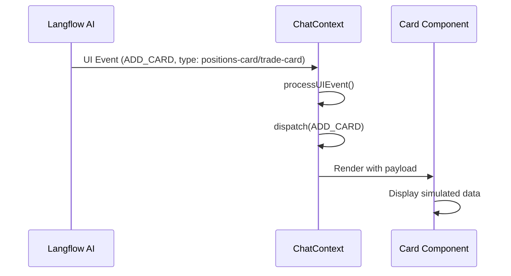

# Design Document: Positions and Trade Cards

## Overview

This design document describes the implementation of two new card components for the Deriv Neo trading simulator: PositionsCard and TradeCard. These components follow the existing card architecture, using CardWrapper for consistent styling and integrating with the ChatContext for state management.

The cards are designed to appear dynamically in response to AI chat interactions, displaying simulated trading data. The implementation prioritizes visual fidelity to the Deriv platform while maintaining the modular, AI-first architecture of the simulator.

## Architecture

### Component Hierarchy

```
src/
├── components/
│   └── cards/
│       ├── PositionsCard.tsx    # New: Active positions display
│       └── TradeCard.tsx        # New: Trade execution interface
├── types/
│   └── index.ts                 # Extended with new types
└── pages/
    └── CardsPage.tsx            # Updated with new card previews
```

### Integration Points

1. **Type System**: New card types added to `CardType` union, new payload interfaces exported
2. **ChatContext**: Existing `processUIEvent` handles new card types via `ADD_CARD` event
3. **CardsPage**: New card sections added to `cardsInfo` array for documentation
4. **CardWrapper**: Reused for consistent card chrome (favorite, archive, styling)

### Data Flow



## Components and Interfaces

### PositionsCard Component

The PositionsCard displays a list of active trading positions in a compact, scannable format.

**Component Structure:**
```
┌─────────────────────────────────────────┐
│ [Icon] ACTIVE POSITIONS        [•••]    │
│                                         │
│ ┌─────────────────────────────────────┐ │
│ │ BTC/USD    Higher    $100 → $195    │ │
│ │ ● Open     Expires: 2:45            │ │
│ └─────────────────────────────────────┘ │
│ ┌─────────────────────────────────────┐ │
│ │ ETH/USD    Lower     $50 → $92      │ │
│ │ ✓ Won      Completed                │ │
│ └─────────────────────────────────────┘ │
└─────────────────────────────────────────┘
```

**Props Interface:**
```typescript
interface PositionsCardProps {
  card: BaseCard;
}
```

**Payload Interface:**
```typescript
interface PositionsCardPayload {
  positions: Position[];
}

interface Position {
  id: string;
  asset: string;
  assetName: string;
  contractType: 'higher' | 'lower' | 'rise' | 'fall' | 'touch' | 'no-touch';
  stake: string;
  payout: string;
  expiryTime: string;
  timeRemaining: string;
  status: 'open' | 'won' | 'lost';
  profit?: string;
}
```

### TradeCard Component

The TradeCard provides a full trading interface matching the Deriv platform design.

**Component Structure:**
```
┌─────────────────────────────────────────┐
│ [↗↘] Higher/Lower          [•••]        │
│ Learn about this trade type             │
│─────────────────────────────────────────│
│ Duration  [Duration ▼] [End time]       │
│ [Days ▼] [────5────]                    │
│ Range: 1 - 365 days                     │
│ Expires: 28 Jan 2025, 23:59:59 GMT      │
│─────────────────────────────────────────│
│ Barrier                                 │
│ [──────1234.56──────]                   │
│ Spot: 1230.45                           │
│─────────────────────────────────────────│
│ Stake    [Stake ▼] [Payout]             │
│ [-] [────10.00────] [+]  USD            │
│─────────────────────────────────────────│
│ ┌─────────────┐  ┌─────────────┐        │
│ │   Higher    │  │    Lower    │        │
│ │   $19.50    │  │   $19.50    │        │
│ │    95%      │  │    95%      │        │
│ └─────────────┘  └─────────────┘        │
└─────────────────────────────────────────┘
```

**Props Interface:**
```typescript
interface TradeCardProps {
  card: BaseCard;
}
```

**Payload Interface:**
```typescript
interface TradeCardPayload {
  asset: string;
  assetName: string;
  tradeType: 'higher-lower' | 'rise-fall' | 'touch-no-touch';
  duration: {
    mode: 'duration' | 'end-time';
    unit: 'days' | 'hours' | 'minutes' | 'ticks';
    value: number;
    range: { min: number; max: number };
    expiryDate: string;
  };
  barrier: {
    value: number;
    spotPrice: number;
  };
  stake: {
    mode: 'stake' | 'payout';
    value: number;
    currency: string;
  };
  payout: {
    higher: { amount: string; percentage: string };
    lower: { amount: string; percentage: string };
  };
}
```

## Data Models

### Extended CardType Union

```typescript
export type CardType = 
  | 'intent-summary' 
  | 'action-ticket' 
  | 'bot-card' 
  | 'portfolio-snapshot' 
  | 'portfolio-table' 
  | 'portfolio-sidebar' 
  | 'portfolio-table-expanded' 
  | 'portfolio-table-complete'
  | 'positions-card'    // New
  | 'trade-card';       // New
```

### Mock Data Structures

**Positions Card Mock:**
```typescript
const mockPositionsCard: BaseCard = {
  id: 'demo-positions-1',
  type: 'positions-card',
  status: 'active',
  isFavorite: false,
  createdAt: new Date(),
  payload: {
    positions: [
      {
        id: 'pos-1',
        asset: 'BTC/USD',
        assetName: 'Bitcoin',
        contractType: 'higher',
        stake: '$100.00',
        payout: '$195.00',
        expiryTime: '2025-01-28T15:30:00Z',
        timeRemaining: '2:45:30',
        status: 'open',
      },
      {
        id: 'pos-2',
        asset: 'ETH/USD',
        assetName: 'Ethereum',
        contractType: 'lower',
        stake: '$50.00',
        payout: '$92.50',
        expiryTime: '2025-01-28T14:00:00Z',
        timeRemaining: '0:00:00',
        status: 'won',
        profit: '+$42.50',
      },
    ],
  },
};
```

**Trade Card Mock:**
```typescript
const mockTradeCard: BaseCard = {
  id: 'demo-trade-1',
  type: 'trade-card',
  status: 'active',
  isFavorite: false,
  createdAt: new Date(),
  payload: {
    asset: 'BTC/USD',
    assetName: 'Bitcoin',
    tradeType: 'higher-lower',
    duration: {
      mode: 'duration',
      unit: 'days',
      value: 5,
      range: { min: 1, max: 365 },
      expiryDate: '28 Jan 2025, 23:59:59 GMT',
    },
    barrier: {
      value: 42500.00,
      spotPrice: 42350.75,
    },
    stake: {
      mode: 'stake',
      value: 10.00,
      currency: 'USD',
    },
    payout: {
      higher: { amount: '$19.50', percentage: '95%' },
      lower: { amount: '$19.50', percentage: '95%' },
    },
  },
};
```

## Correctness Properties

*A property is a characteristic or behavior that should hold true across all valid executions of a system—essentially, a formal statement about what the system should do. Properties serve as the bridge between human-readable specifications and machine-verifiable correctness guarantees.*

Based on the prework analysis, the following properties have been identified and consolidated to eliminate redundancy:

### Property 1: Positions Card Data Completeness

*For any* PositionsCardPayload with a list of positions, the rendered PositionsCard output SHALL contain all data fields for each position: asset symbol, asset name, contract type, stake amount, payout amount, time remaining, and status.

**Validates: Requirements 1.2, 1.3, 1.4, 1.5, 1.6, 1.7**

### Property 2: Positions Card Status Color Mapping

*For any* position with status "won", the rendered output SHALL include green color indicators (e.g., `text-green-*` or `bg-green-*` classes). *For any* position with status "lost", the rendered output SHALL include red color indicators (e.g., `text-red-*` or `bg-red-*` classes).

**Validates: Requirements 1.8, 1.9**

### Property 3: Trade Card Payload Rendering

*For any* TradeCardPayload, the rendered TradeCard output SHALL contain: the trade type in the header, the asset information, the duration value and expiry date, the barrier value and spot price, the stake value and currency, and the payout amounts and percentages on action buttons.

**Validates: Requirements 2.2, 2.4, 3.4, 3.5, 4.2, 5.3, 6.3, 6.4**

### Property 4: Trade Card Mode-Based Rendering

*For any* TradeCardPayload where duration.mode is "duration", the rendered output SHALL include a unit selector and numeric input. *For any* TradeCardPayload where stake.mode is "stake", the rendered output SHALL display the calculated payout. *For any* TradeCardPayload where stake.mode is "payout", the rendered output SHALL display the required stake.

**Validates: Requirements 3.2, 3.3, 5.4, 5.5**

## Error Handling

### Invalid Payload Handling

Both card components should gracefully handle edge cases in payload data:

1. **Empty Positions Array**: PositionsCard displays an empty state message when `positions` array is empty
2. **Missing Optional Fields**: Components use fallback values for optional fields (e.g., `profit` in Position)
3. **Invalid Status Values**: Default to 'open' status if an unrecognized status is provided
4. **Malformed Numbers**: Display raw string values if parsing fails

### Type Safety

TypeScript interfaces ensure compile-time validation of payload structures. Runtime type guards are not required for this simulation as all data is controlled mock data.

## Testing Strategy

### Dual Testing Approach

This feature requires both unit tests and property-based tests for comprehensive coverage:

- **Unit tests**: Verify specific examples, edge cases, and error conditions
- **Property tests**: Verify universal properties across all valid inputs

### Property-Based Testing Configuration

- **Library**: Use `fast-check` for property-based testing in TypeScript/React
- **Iterations**: Minimum 100 iterations per property test
- **Tag Format**: `Feature: positions-trade-cards, Property {number}: {property_text}`

### Test Categories

1. **Component Rendering Tests** (Unit)
   - PositionsCard renders with mock data
   - TradeCard renders with mock data
   - CardWrapper integration works correctly

2. **Data Display Properties** (Property-Based)
   - Property 1: All position fields appear in output
   - Property 2: Status colors map correctly
   - Property 3: All trade card fields appear in output
   - Property 4: Mode-based conditional rendering

3. **Integration Tests** (Unit)
   - CardsPage displays both new cards
   - UI events create correct card types

### Example Test Structure

```typescript
// Property test example using fast-check
import fc from 'fast-check';
import { render } from '@testing-library/react';

// Feature: positions-trade-cards, Property 1: Positions Card Data Completeness
describe('PositionsCard', () => {
  it('renders all position data fields for any valid payload', () => {
    fc.assert(
      fc.property(
        fc.array(positionArbitrary, { minLength: 1, maxLength: 10 }),
        (positions) => {
          const card = createMockCard('positions-card', { positions });
          const { container } = render(<PositionsCard card={card} />);
          
          positions.forEach(pos => {
            expect(container.textContent).toContain(pos.asset);
            expect(container.textContent).toContain(pos.contractType);
            expect(container.textContent).toContain(pos.stake);
            expect(container.textContent).toContain(pos.payout);
            expect(container.textContent).toContain(pos.status);
          });
        }
      ),
      { numRuns: 100 }
    );
  });
});
```
